

  <h1 align="center">  OmniAgent </h1>

> **📚 教学项目说明**  
> OmniAgent 是一个**展示AI Agent开发的现代化教学项目**，旨在通过完整的系统实现帮助学习者理解AI工程体系。项目涵盖了从Agent架构、RAG系统到MCP协议的核心技术栈，适合希望深入学习AI应用开发的学习者和开发者参考学习。

## 作者介绍

  

  <b>dtsola</b> — IT架构师 | 一人公司实践者

  🌐 <a href="https://www.dtsola.com">个人站点</a> &nbsp;|&nbsp;
  📺 <a href="https://space.bilibili.com/736015">B站</a> &nbsp;|&nbsp;
  💬 微信：dtsola（技术交流 | 商务合作）

  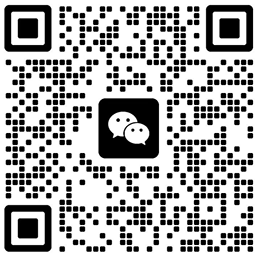
  &nbsp;&nbsp;&nbsp;&nbsp;&nbsp;&nbsp;
  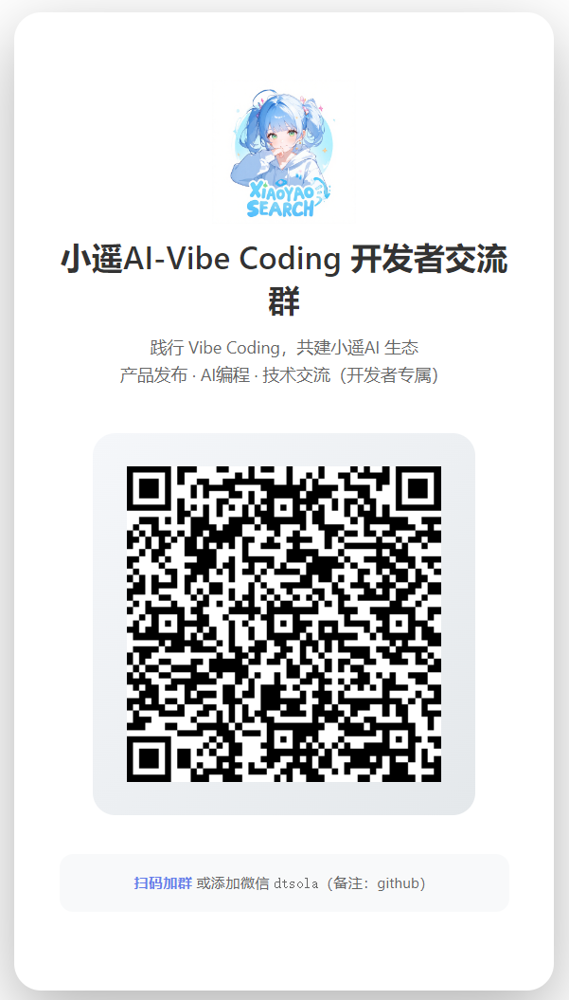
  &nbsp;&nbsp;&nbsp;&nbsp;&nbsp;&nbsp;
  

  <small>微信联系 &nbsp;&nbsp;&nbsp;&nbsp;&nbsp;&nbsp;&nbsp;&nbsp; 开发者交流群 &nbsp;&nbsp;&nbsp;&nbsp;&nbsp;&nbsp;&nbsp;&nbsp; 用户交流群</small>

---

### 📦 项目来源

- **原项目**：[OmniAgent](https://gitee.com/coting/OmniAgent) by [coting](https://gitee.com/coting)
- **项目性质**：基于原项目的二次开发教学版本
- **开源协议**：MIT License

> 本项目是在原项目基础上的二次开发版本，感谢原作者 **coting** 的开源贡献。原项目为我们提供了优秀的AI系统架构基础，让我们能够在现有基础上进行定制化改进和功能扩展。

---

OmniAgent是一个基于大语言模型的现代化智能对话系统，支持多Agent协作、知识库检索、工具调用、MCP服务器集成、实时对话等功能。

## 什么是 OmniAgent？

OmniAgent 是一个面向工程实践的AI系统项目，它不仅仅是一个聊天工具，而是一个完整的AI能力整合平台。

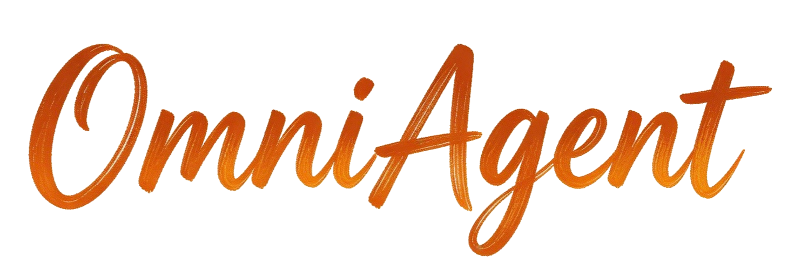

可以把它理解为：

> **一个集成了大模型能力、Agent机制、知识检索、工具调用和前后端系统的完整AI工程模板**

它最大的特点在于：**技术栈非常全面，几乎覆盖当前主流AI工程体系**。

在后端层面，它融合了：

- 基于 **FastAPI** 的高性能服务架构  
- 基于 **LangChain** 的Agent与流程编排  
- 多模型接入（支持主流大模型生态）  
- **RAG检索增强生成系统**  
- **Tool Calling 工具调用机制**  
- **MCP协议（模型上下文扩展能力）**  
- Redis / MySQL 等工程级数据管理  

在前端层面，它提供了：

- 基于 **Vue3 + TypeScript** 的现代化界面  
- 实时流式对话体验  
- Agent配置与管理界面  
- 知识库与工具的可视化操作  

在AI能力层面，它实现了：

- 多Agent协作  
- 自动任务拆解与规划  
- 工具链执行能力  
- 语义检索与知识增强  
- Prompt + Skill 机制  

## 项目亮点

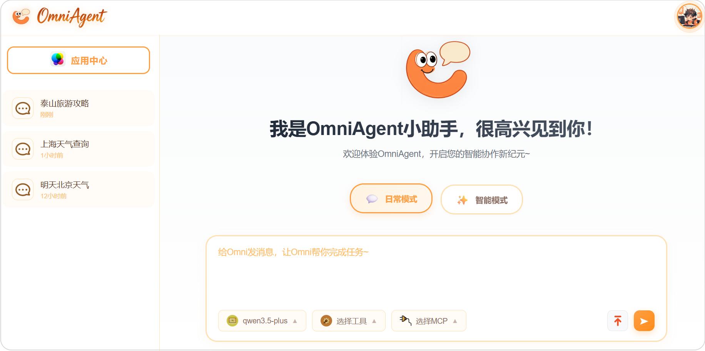

OminiAgent包含以下核心能力：

<h4>1. 智能 Agent 协作与编排</h4>

- **多智能体协同** (Multi-Agent Collaboration)：支持任务自动分解与跨 Agent 分工，通过任务流程图实时可视化推理决策路径，实现复杂问题的自动化闭环。
- **智能任务规划**：具备实时的任务规划能力，能够根据用户意图动态生成执行计划，并在工作区与应用中心间无缝切换执行上下文。

<h4>2. 增强型 RAG 知识库系统</h4>

- **全格式文档解析引擎**：内置基于物理布局感知的解析模块，支持 PDF、Docx、Markdown 等多格式智能分块（Chunking），确保语义完整性。
- **混合检索与重排序**：集成向量数据库（ChromaDB/Milvus）与全文本搜索，支持语义检索与关键词检索的协同优化，提升知识调用的召回精度。

<h4>3. 插件化工具与 MCP 生态</h4>

- **MCP 服务器深度集成**：原生支持 Model Context Protocol，允许用户动态上传并挂载自定义 MCP 服务，扩展模型对外部环境的感知与操作边界。
- **自定义 Skill 与工具链**：支持通过 OpenAPI/Swagger 上传构建自定义工具，并通过 "Skill" 机制实现 Prompt 的渐进式加载，按需教导模型处理特定业务逻辑。 

<h4>4. 高可用模型路由与工程化</h4>

- **多模型统一调度**：兼容 OpenAI、DeepSeek、通义千问等主流大模型协议，支持流式响应（SSE）与多轮对话状态管理。
- **国产化与私有化适配**：支持 MiniO 本地对象存储，满足企业级私有化部署的合规需求。 

<h4>5. 自动化数据入库 ETL Pipeline</h4>

- **结构化入库流程**：涵盖数据抓取、语义增强、向量化到写入数据库的全链路管道，支持针对不同垂直领域的知识库灵活配置。
- **可视化监控与看板**：提供精细化数据看板，实时追踪各 Agent、模型的调用频率、Token 消耗及响应耗时，实现运营成本的可视化。  

<h4>6. 现代化的交互与管理界面</h4>

- **响应式工作区**：基于 Vue 3.4 + Element Plus 打造的现代化 UI，支持多对话管理、深度思考面板可视化，以及沉浸式的工作流编辑体验。
- **全栈权限与安全控制**：内置基于 JWT 的安全认证体系，提供细粒度的用户权限管理与系统参数热配置。   

## OmniAgent 核心设计

OmniAgent的核心价值在于其清晰的系统架构和完整的执行流程，这也是它区别于普通项目的关键。

### 技术架构设计

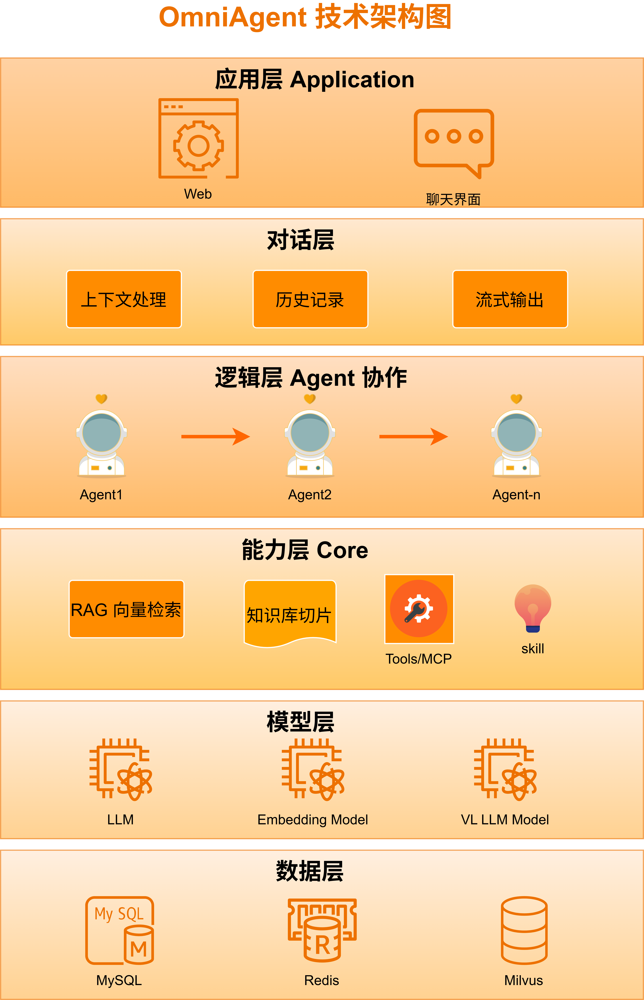

整个系统采用分层设计思想，将复杂系统拆解为多个独立模块：

- **用户层**：负责交互（Web界面 / 对话系统）
- **对话层**：处理上下文、历史记录、流式输出
- **Agent决策层**：负责任务拆解与执行规划
- **能力层**：
  - RAG（知识检索）
  - Tools（工具调用）
  - MCP（扩展能力）
- **模型层**：大语言模型与Embedding模型
- **数据层**：数据库、缓存、向量数据库

这种架构的优势在于：

- **高可扩展性**：每一层都可以独立替换或增强  
- **强解耦**：功能之间不会强绑定  
- **工程友好**：适合团队开发与演进  

### 核心执行流程

当用户输入一个问题时，系统并不是简单地调用模型，而是会经过一系列智能处理流程：
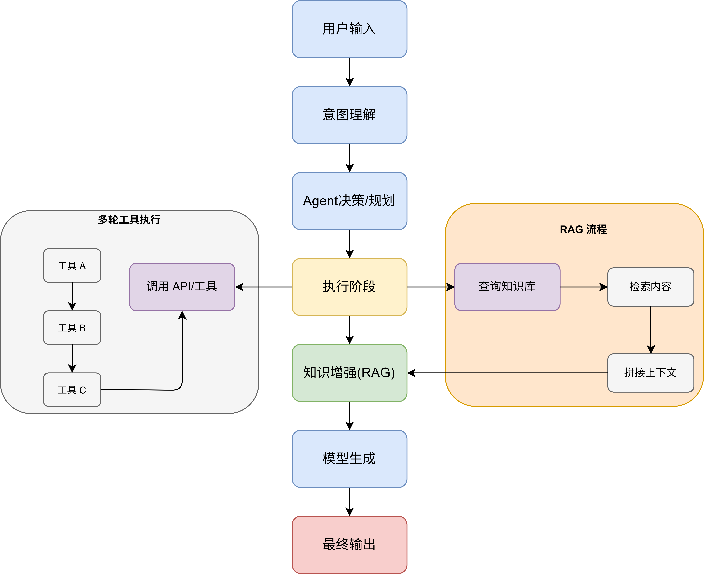

首先，系统会对输入进行理解，判断用户的真实意图，例如是否需要查询知识库、调用工具，或者进行复杂任务。

接下来进入Agent决策阶段，系统会自动拆解任务，例如：

- 查询信息  
- 调用API  
- 组合结果  

如果涉及工具调用，则会进入多轮执行流程：

- 工具A → 工具B → 工具C（逐步依赖执行）

如果涉及知识增强，则会触发RAG流程：

- 检索相关内容  
- 拼接上下文  
- 提供给模型生成更准确结果  

最后，由模型生成最终回答并返回给用户。

整个过程形成一个闭环：

> **输入 → 理解 → 规划 → 执行 → 增强 → 输出**

## 界面预览

### OmniAgent平台登录页
*安全便捷的用户认证系统*
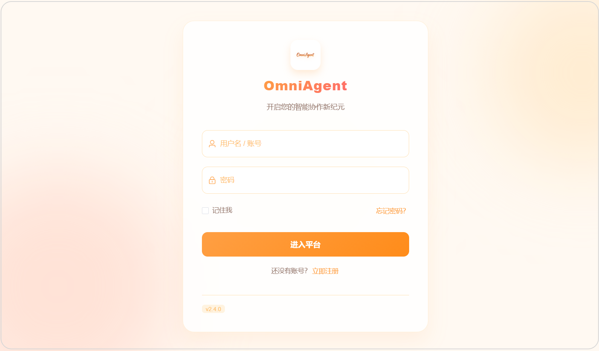

### OmniAgent平台首页
*简洁现代的主界面，提供直观的功能导航*

### 智能规划模式
*实时的任务流程图，更加直观的感受*
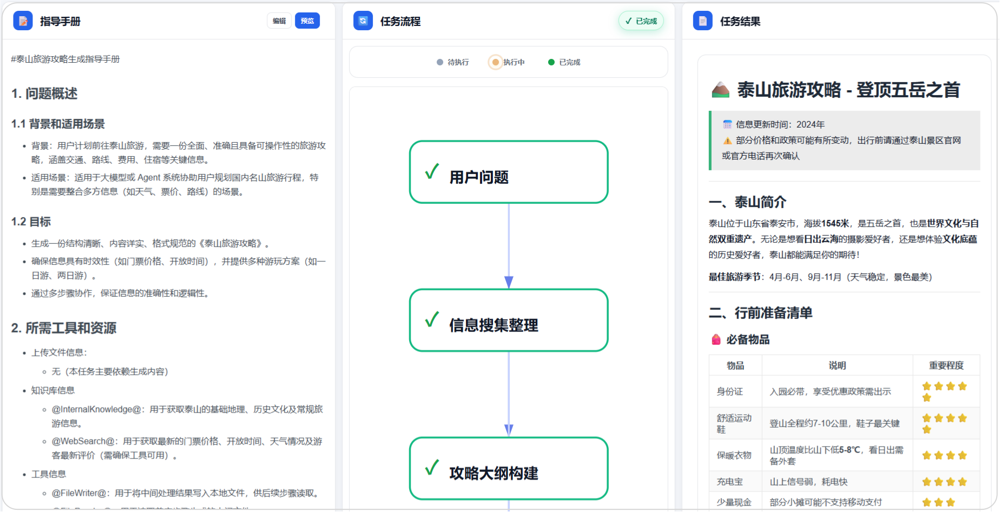

### MCP服务器集成
*支持Model Context Protocol，可上传自定义MCP服务*

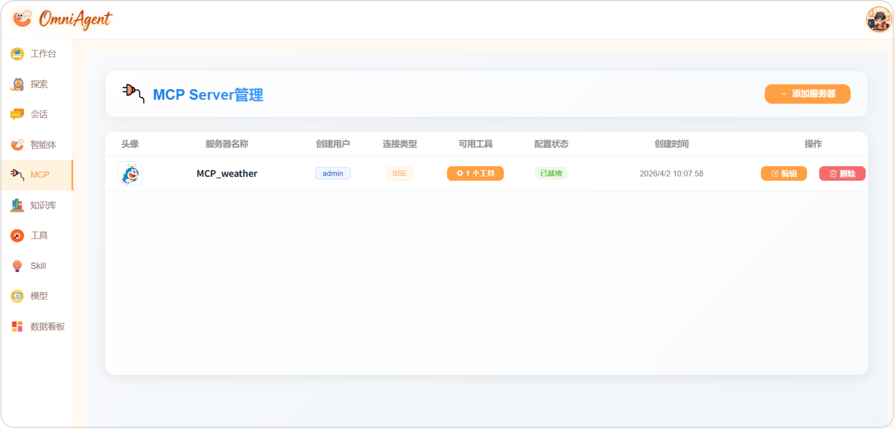

### 知识库管理系统
*智能知识管理，为Agent提供丰富的外部知识支持*

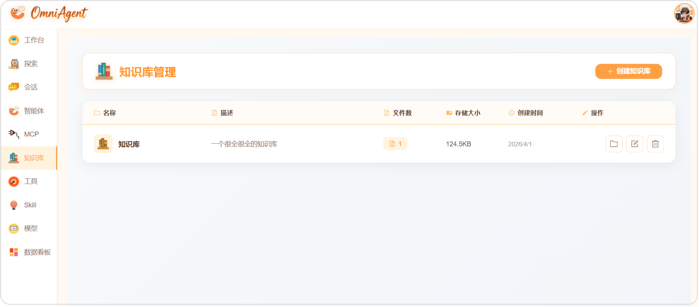

### 文档解析引擎
*支持PDF、Markdown、Docx、Txt等多种格式的智能解析*

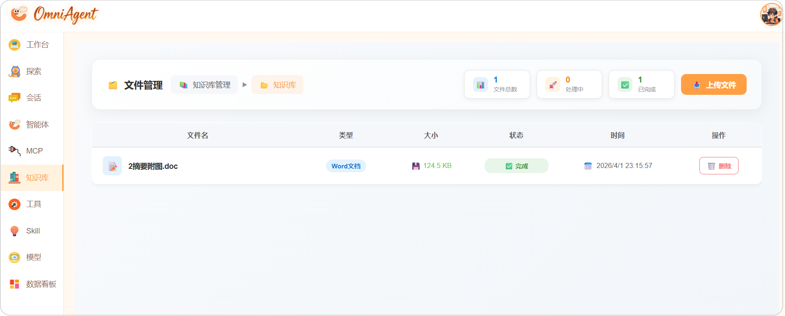

### Skill 管理中心
*能够管理所有已上传的Skill，包括查看、删除、更新等操作*

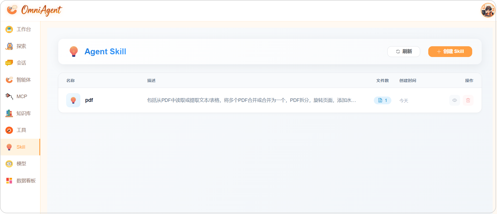

### 智能体管理页面
*强大的Agent配置和管理中心*

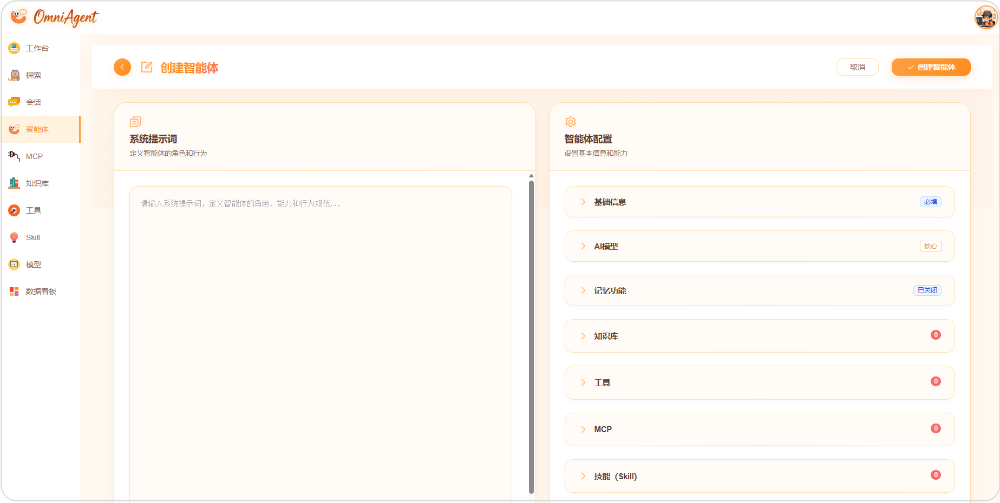

### 智能Agent功能演示

#### 天气查询Agent
*实时天气信息查询和预报*

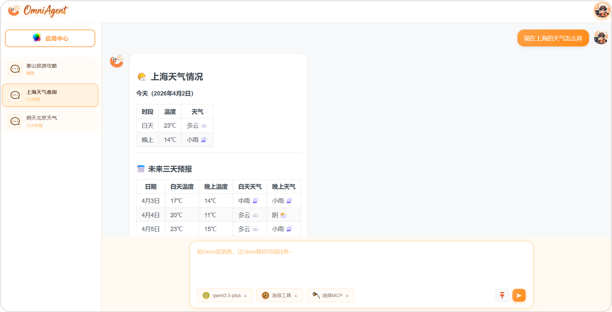

### 工具管理中心
*丰富的内置工具集，支持用户自定义上传工具*

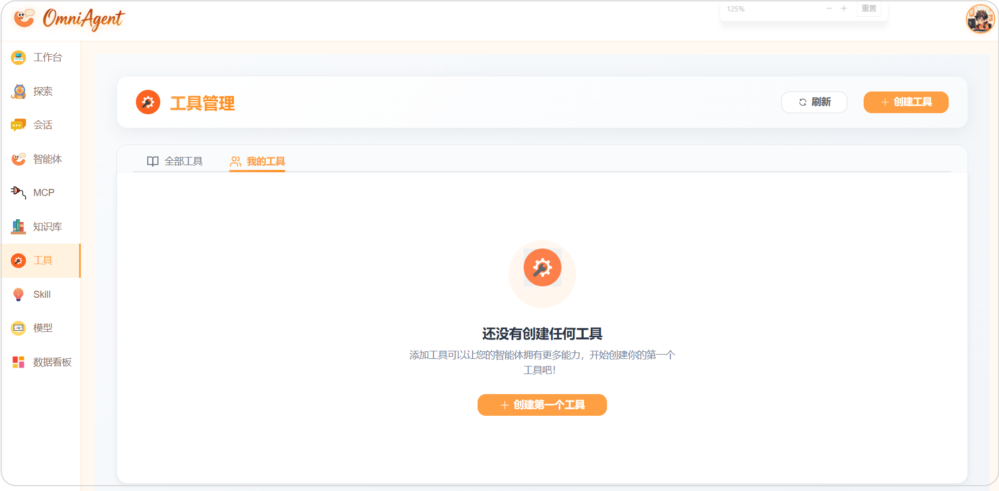

### AI模型管理
*多模型支持，灵活配置不同AI服务*

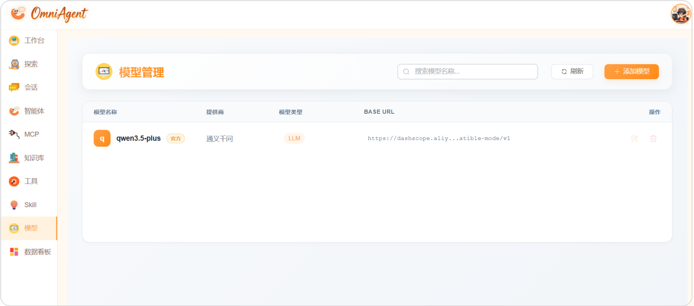

### 数据看板
*能够根据Agent、模型、时间范围进行筛选调用次数和Token使用量* 
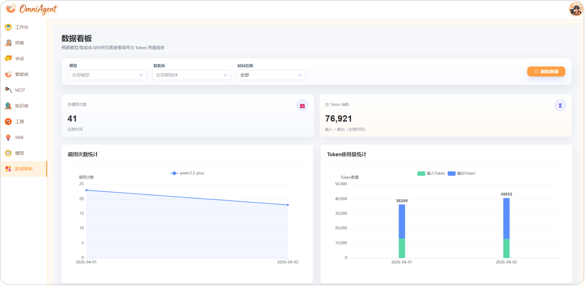    

## 项目质量

相比很多展示型开源项目，OmniAgent更接近真实工程环境。

首先，在工程结构上，它具备清晰的模块划分，例如API层、服务层、工具层、数据层等，符合实际开发规范。

其次，在功能设计上，它不仅仅实现单点能力，而是构建了完整系统，包括多Agent协作机制、工具链执行逻辑、知识库与RAG系统  

此外，在扩展性方面，它支持自定义工具接入、多模型扩展、新Agent能力添加  

同时，项目还具备工程级能力，包括Redis缓存机制、向量数据库支持、异步任务处理  

除了技术栈非常丰富，项目还提供了相当丰富的**技术文档和知识点文档**，帮助大家更好的理解项目架构和实现细节，来准备**面试**或者**求职**。

## 你能学到什么？

完成这个项目后，你获得的不只是一个代码仓库，而是一整套能力体系。

在AI能力层面，你将掌握：

- Agent系统设计方法  
- RAG架构实现  
- Prompt工程进阶技巧  
- Tool Calling机制  
- 多模型协同策略  

在工程能力层面，你将掌握：

- FastAPI后端开发  
- 前后端联调流程  
- 流式输出与实时通信  
- Docker部署与环境管理  

更重要的是，在架构层面，你会理解：

- 如何设计一个AI系统  
- 如何拆解复杂功能  
- 如何构建可扩展架构  

## 适合人群

这个项目更适合有一定基础，希望进阶的人群。

对于学生或求职者来说，如果你希望进入AI或大模型相关岗位，并且需要一个有深度的项目提升竞争力，这个项目非常适合。

对于后端或算法工程师来说，如果你希望从传统开发转向AI工程方向，补齐Agent与RAG能力，这将是一个非常好的实践路径。

对于想做AI产品的人来说，这个项目可以帮助你理解AI产品是如何构建的、AI能力如何转化为功能、系统如何支持业务

需要注意的是，如果是完全零基础的，建议先具备以下能力再学习：

- Python基础
- 基本的机器学习或大模型知识
